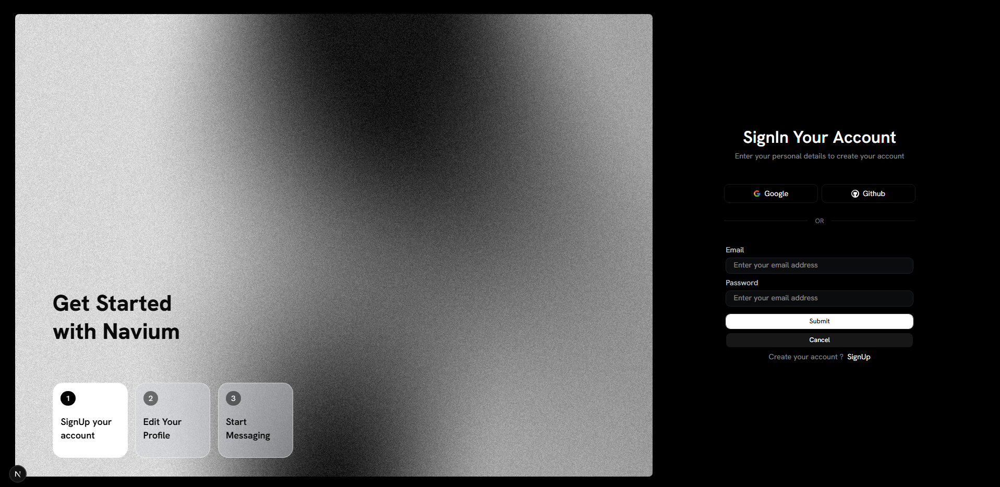
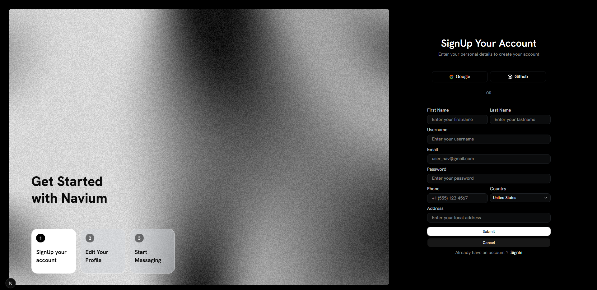
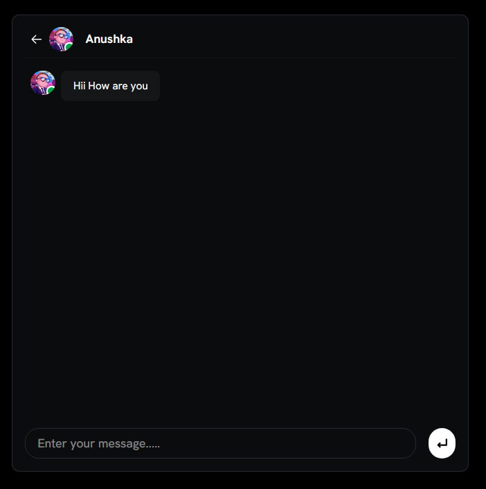

Navium
- A modern chat application and social media platform designed for seamless messaging and community building.
- Built with NextJS, Prisma, Radix UI, and Tailwind CSS for a smooth, responsive user experience.
- Features real-time messaging, user authentication, profile management, and a beautiful dark-themed interface with custom gradient animations.
- Used Bun package manager with Next.js 16 for optimal performance and fast builds.






Setup
- ```git clone https://github.com/yourusername/navium.git``` for HTTPS web url.
- ```git clone git@github.com:yourusername/navium.git``` for SSH key.
- ```cp .env.example .env```
- Set the required environment variables in `.env`.
- ```bun install``` to install dependencies.
- ```bun --bunx prisma migrate dev``` to sync the database with your ORM.
- ```bun --bunx prisma generate``` to generate Prisma client.
- ```bun dev``` for development purposes.
- ```bun build``` for production purposes.

Features
- **Authentication**: Secure user sign-in and sign-up with email/password and OAuth (Google, GitHub).
- **Real-time Messaging**: Chat with other users with a responsive chat interface.
- **User Profiles**: Manage your profile information including personal details and preferences.
- **Social Elements**: Step-based onboarding and user discovery.
- **Dark Theme**: Beautiful dark-themed UI with smooth animations and gradients.
- **Responsive Design**: Fully responsive layout that works on desktop and mobile devices.

Made with ❤️ by Navium Team.
